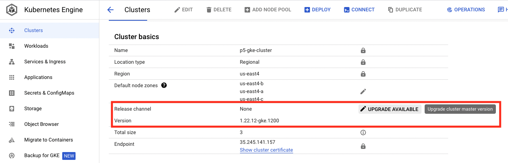
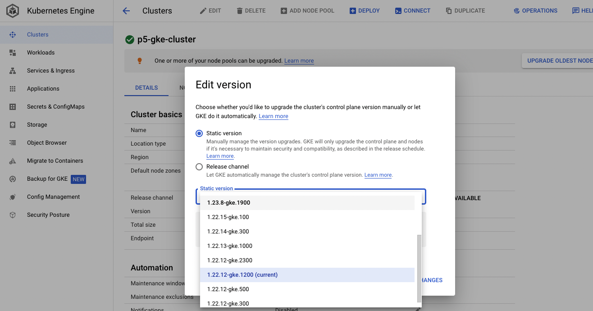
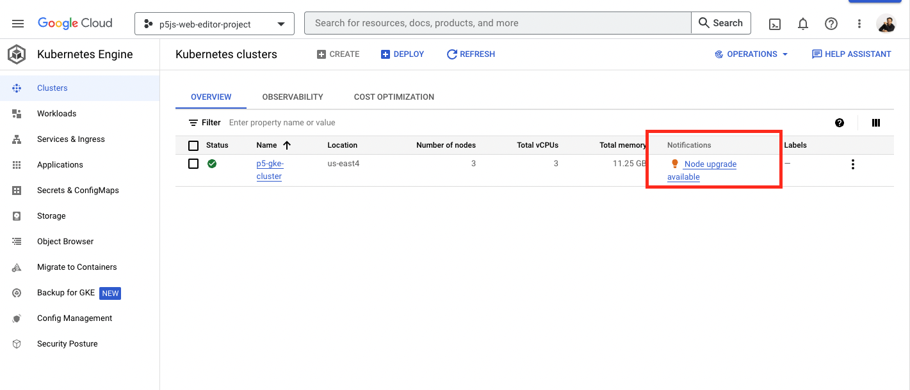

## Quickly Rolling Back a Deploy

1. Since the latest tag is being used, we can't simply just repoint the image back to the previous release, but we can instead use Kubernetes' built in rollback feature.
1. `kubectl rollout undo deployment.apps/web-editor-node -n production`

## Upgrading the GKE Cluster

1. Log into the [Google Cloud Platform console](https://console.cloud.google.com/) and go to the GKE service and click into the p5-gke-cluster.
1. There are two components of GKE that need to be upgraded, the control plane (or cluster master node), and the cluster nodes themselves (or node pools), in that order.

### Upgrading the GKE control plane

1. Upgrade the GKE control plane first, by following the steps below.

1. Look up the latest available version in the [Kubernetes release changelog](https://kubernetes.io/releases/) to determine if there are any breaking changes that will require updates to your manifest files. Based on this information, determine the version you want to upgrade the cluster to (ideally the latest supported version) and hit save changes. This should begin the control plane upgrade. Since this is a regional cluster, there should be no downtime during this process however, the API will be unavailable, so do not attempt a deploy during the upgrade.

### Upgrading the GKE node pool

1. Wait until the GKE control plane upgrade is complete and then proceed by upgrading the GKE node pool using the following steps.
1. Navigate to the workloads page to make sure that you have a few replicas (pods) of each service running in the cluster so that the node draining process doesn't cause downtime.
1. Navigate back to the main GKE service page where you see the cluster listing and you should see that there is an update available.

1. Select the version that is the same as the control plane.

### Update the version in the terraform

1. Since we've done the upgrade manually, the terraform file should be updated to reflect the current version in case we need to recreate the cluster from scratch.
1. Update the default GKE version [here](https://github.com/processing/p5.js-web-editor/blob/develop/terraform/variables.tf#L13).
